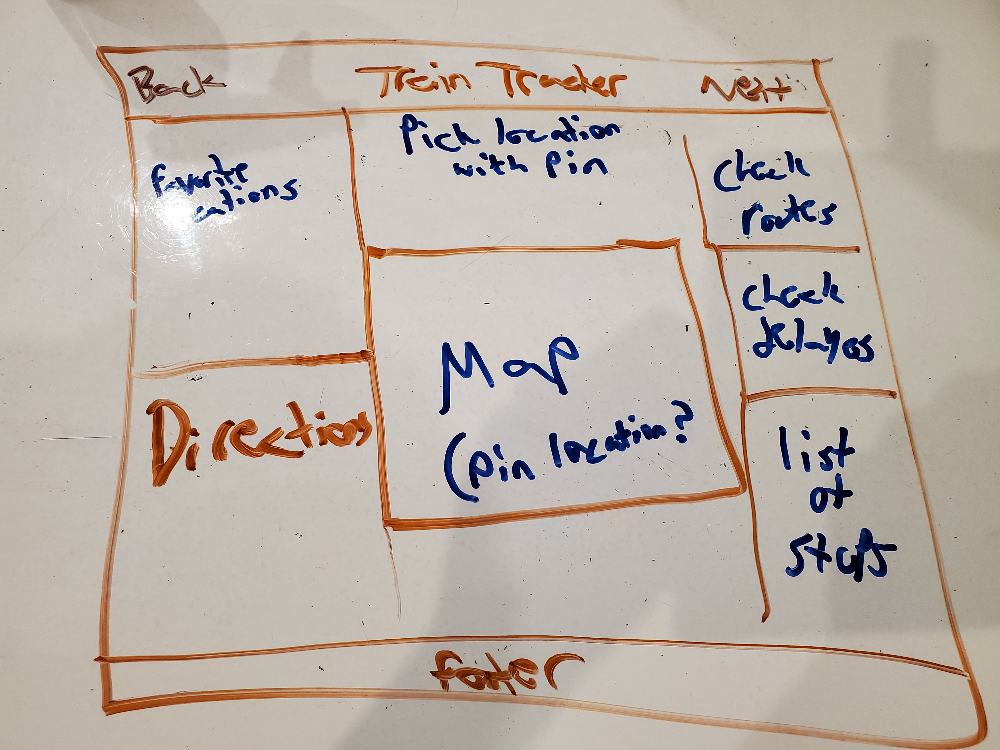

# Project Overview


## Train Tracker

**Project decription:** An app that will let the user enter location either by a search bar but probably with a pin. Then the user will be able to find train station, routes, times, delays sent to them in real time.

## API Snippet

```

  "type": "FeatureCollection",
  "features": [
    {"type":"Feature","properties":{"name":"Astor Pl","url":"http://web.mta.info/nyct/service/","line":"4-6-6 Express","objectid":"1","n
```

## Wireframes


### MVP  
- Find and use external api for both open data and mapbox
- Render map and directions 
- get live updates for train schedules, stop, time and delays


### Post-MVP
- Allow user to choose favorites using local storage
- Advanced real time updates
- fetch user location


#### PostMVP EXAMPLE:
- live directions

## React Component Hierarchy



## Components
| components            | description                            | type       |
|-----------------------|----------------------------------------|------------|
| header                | will hold logo and nav                 | functional |
| footer                | copyright                              | functional |
| map                   | hold map data and render map           | functional |
| delay list            | updated delays                         | functional |
| train list            | every line and times                   | functional |
| stop and station list | holds data for both stations and stops | functional |


## Priority Matrix


## Timeframes
| component             | priority | estimated time | time invested | actual time |
|-----------------------|----------|----------------|---------------|-------------|
| header                | M        | 3HR            | 0             | 0           |
| MAP                   | H        | 10HR           | 12HR           | 12hr           |
| OPEN DATA AND MAPBOX  | H        | 10HR           | 6HR           | 0           |
| FOOTER                | L        | 2HR            | 0             | 0           |
| DELAY LIST            | M        | 10HR           | 0             | 0           |
| STOP AND STATION LIST | H        | 10HR           | 0             | 0           |
| DIRECTIONS            | M        | 10HR           | 0             | 0           |
| TOTAL                 |          | 55HR           | 6             | 0           |
|
| Total | H | 55hrs| 6hrs | 6hrs |

## Project Schedule

|  Day | Deliverable | Status
|---|---| ---|
|Jan 24th| Project Pitch / Wireframes / Priority Matrix / Functional Components | Incomplete
|Jan 27th| Have complete access and control of both apis | Incomplete
|Jan 28th| have a functional search bar and map | Incomplete
|Jan 29th|live updates, directions and css styling| Incomplete
|Jan 30th| favorites, fetch location,  and finish styling| Incomplete
|Jan 31tst| Present | Incomplete

## Additional Libraries
|React Router | be able to route to different pages|
|axios| be able to get both my apis|

## Issues and Resolutions

|geting my api| going to try over the weekend to get them to work|

## Code Snippet

Use this section to include a brief code snippet you are proud of, along with a brief description of why.

```
function reverse(string) {
	// here is the code to reverse a string of text
}
```

## Change Log
 Use this section to document what changes were made in your overall planning and the reasoning behind those changes.  
